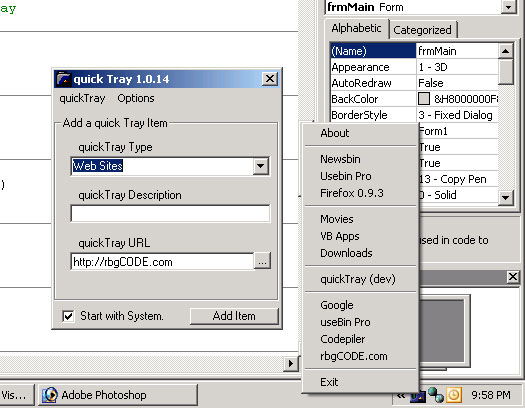

<div align="center">

## A great utility, I call it quick tray quicktray 1\.0\.14


</div>

### Description

A mutant cross of your quick launch and system tray! quickTray is to help you save taskbar space, and allowing you to close your windows and open them back up...

I made this because taskbar space is something very important to me, and I never seem to have enough of it. Like, When I download a movie lets say, I open d:\downloads, then I have to decompress it, then I open that folder, and either un ISO it or just move it then to d:\Movies, or music, etc etc. You get the point.

Anyways, this is so that you can access webpages apps, folders, anything you need to at the easy click of a mouse.

This app isnt commented, because I dont like commenting code, but it shows you how to change the registry, how to add files and read files from a txt, and how to open applications using simple system32 api.

I call it... quickTray

<b>Beware, this may cause mild forms of efficiency!</b>
 
### More Info
 
Ok, I am still working on this, like a screen to organize and delete the info, for now just use notepad! Also, I am working on it extracting and using the icon in the menu just like in quick launch, and eventually I would like to enable it to watch for certain keystrokes, which I already made some code for, but it hangs the cpu at around 50% because it is a key hooker. But you can type like [ctrl][ctrl]vb and it opens up the application you want for that.

If anyone wants to help me finish this up, or wants to see any more of my code like the keyhook please let me know. I only share code I think people will comment on.. But I have lots..

<b>Beware, this may cause mild forms of efficiency!</b>

Beware, this may cause mild forms of efficiency!


<span>             |<span>
---                |---
**Submitted On**   |2004-08-08 21:58:40
**By**             |[rBg](https://github.com/Planet-Source-Code/PSCIndex/blob/master/ByAuthor/rbg.md)
**Level**          |Intermediate
**User Rating**    |4.8 (24 globes from 5 users)
**Compatibility**  |VB 4\.0 \(32\-bit\), VB 5\.0, VB 6\.0
**Category**       |[Files/ File Controls/ Input/ Output](https://github.com/Planet-Source-Code/PSCIndex/blob/master/ByCategory/files-file-controls-input-output__1-3.md)
**World**          |[Visual Basic](https://github.com/Planet-Source-Code/PSCIndex/blob/master/ByWorld/visual-basic.md)
**Archive File**   |[A\_great\_ut177987882004\.zip](https://github.com/Planet-Source-Code/rbg-a-great-utility-i-call-it-quick-tray-quicktray-1-0-14__1-55455/archive/master.zip)

### API Declarations

```
rbgCODE.... nuff said!
<b>Beware, this may cause mild forms of efficiency!</b>
```


